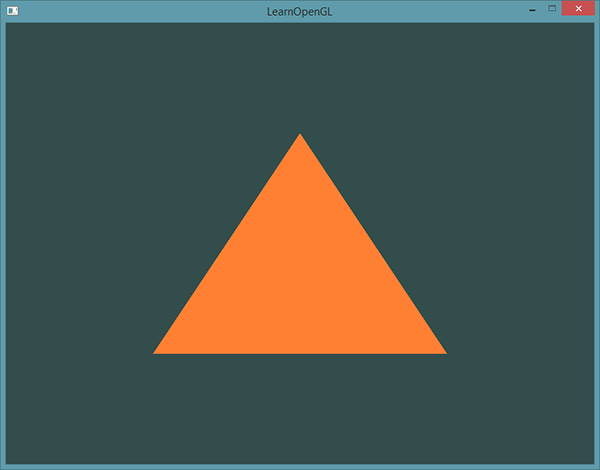

# OpenGL

一般它被认为是一个API(Application Programming Interface, 应用程序编程接口)，包含了一系列可以操作图形、图像的函数。然而，OpenGL本身并不是一个API，它仅仅是一个由[Khronos组织](http://www.khronos.org/)制定并维护的规范(Specification)。

OpenGL规范严格规定了每个函数该如何执行，以及它们的输出值。至于内部具体每个函数是如何实现(Implement)的，将由OpenGL库的开发者自行决定（译注：这里开发者是指编写OpenGL库的人）。

实际的OpenGL库的开发者通常是显卡的生产商。你购买的显卡所支持的OpenGL版本都为这个系列的显卡专门开发的。当你使用Apple系统的时候，OpenGL库是由Apple自身维护的。在Linux下，有显卡生产商提供的OpenGL库，也有一些爱好者改编的版本。这也意味着任何时候OpenGL库表现的行为与规范规定的不一致时，基本都是库的开发者留下的bug。

核心模式与立即渲染模式

> 由于OpenGL的大多数实现都是由显卡厂商编写的，当产生一个bug时通常可以通过升级显卡驱动来解决。这些驱动会包括你的显卡能支持的最新版本的OpenGL，这也是为什么总是建议你偶尔更新一下显卡驱动。

## 核心模式与立即渲染模式

立即渲染模式从OpenGL**实际**运作中抽象掉了很多细节，因此它在易于学习的同时，也很难让人去把握OpenGL具体是如何运作的。现代函数要求使用者真正理解OpenGL和图形编程，它有一些难度，然而提供了更多的灵活性，更高的效率，更重要的是可以更深入的理解图形编程。

> 当使用新版本的OpenGL特性时，只有新一代的显卡能够支持你的应用程序。这也是为什么大多数开发者基于较低版本的OpenGL编写程序，并只提供选项启用新版本的特性。

## 扩展

OpenGL的一大特性就是对扩展(Extension)的支持，当一个显卡公司提出一个新特性或者渲染上的大优化，通常会以扩展的方式在驱动中实现。如果一个程序在支持这个扩展的显卡上运行，开发者可以使用这个扩展提供的一些更先进更有效的图形功能。通过这种方式，开发者不必等待一个新的OpenGL规范面世，就可以使用这些新的渲染特性了，只需要简单地检查一下显卡是否支持此扩展。通常，当一个扩展非常流行或者非常有用的时候，它将最终成为未来的OpenGL规范的一部分。

使用扩展的代码大多看上去如下：

```
if(GL_ARB_extension_name)
{
    // 使用硬件支持的全新的现代特性
}
else
{
    // 不支持此扩展: 用旧的方式去做
}
```

## 状态机

OpenGL自身是一个巨大的状态机(State Machine)：一系列的变量描述OpenGL此刻应当如何运行。OpenGL的状态通常被称为OpenGL上下文(Context)。我们通常使用如下途径去更改OpenGL状态：设置选项，操作缓冲。最后，我们使用当前OpenGL上下文来渲染。

假设当我们想告诉OpenGL去画线段而不是三角形的时候，我们通过改变一些上下文变量来改变OpenGL状态，从而告诉OpenGL如何去绘图。一旦我们改变了OpenGL的状态为绘制线段，下一个绘制命令就会画出线段而不是三角形。

当使用OpenGL的时候，我们会遇到一些状态设置函数(State-changing Function)，这类函数将会改变上下文。以及状态使用函数(State-using Function)，这类函数会根据当前OpenGL的状态执行一些操作。只要你记住OpenGL本质上是个大状态机，就能更容易理解它的大部分特性。

## 对象

OpenGL库是用C语言写的，同时也支持多种语言的派生，但其内核仍是一个C库。由于C的一些语言结构不易被翻译到其它的高级语言，因此OpenGL开发的时候引入了一些抽象层。“对象(Object)”就是其中一个。

在OpenGL中一个对象是指一些选项的集合，它代表OpenGL状态的一个子集。比如，我们可以用一个对象来代表绘图窗口的设置，之后我们就可以设置它的大小、支持的颜色位数等等。可以把对象看做一个C风格的结构体(Struct)：

```
struct object_name {
    float  option1;
    int    option2;
    char[] name;
};
```

当我们使用一个对象时，通常看起来像如下一样（把OpenGL上下文看作一个大的结构体）：

```
// OpenGL的状态
struct OpenGL_Context {
    ...
    object* object_Window_Target;
    ...     
};
// 创建对象
unsigned int objectId = 0;
glGenObject(1, &objectId);
// 绑定对象至上下文
glBindObject(GL_WINDOW_TARGET, objectId);
// 设置当前绑定到 GL_WINDOW_TARGET 的对象的一些选项
glSetObjectOption(GL_WINDOW_TARGET, GL_OPTION_WINDOW_WIDTH, 800);
glSetObjectOption(GL_WINDOW_TARGET, GL_OPTION_WINDOW_HEIGHT, 600);
// 将上下文对象设回默认
glBindObject(GL_WINDOW_TARGET, 0);
```

这一小段代码展现了你以后使用OpenGL时常见的工作流。我们首先创建一个对象，然后用一个id保存它的引用（实际数据被储存在后台）。然后我们将对象绑定至上下文的目标位置（例子中窗口对象目标的位置被定义成GL_WINDOW_TARGET）。接下来我们设置窗口的选项。最后我们将目标位置的对象id设回0，解绑这个对象。设置的选项将被保存在objectId所引用的对象中，一旦我们重新绑定这个对象到GL_WINDOW_TARGET位置，这些选项就会重新生效。

使用对象的一个好处是在程序中，我们不止可以定义一个对象，并设置它们的选项，每个对象都可以是不同的设置。在我们执行一个使用OpenGL状态的操作的时候，只需要绑定含有需要的设置的对象即可。比如说我们有一些作为3D模型数据（一栋房子或一个人物）的容器对象，在我们想绘制其中任何一个模型的时候，只需绑定一个包含对应模型数据的对象就可以了（当然，我们需要先创建并设置对象的选项）。拥有数个这样的对象允许我们指定多个模型，在想画其中任何一个的时候，直接将对应的对象绑定上去，便不需要再重复设置选项了。

# 创建窗口

## GLFW

GLFW是一个专门针对OpenGL的C语言库，它提供了一些渲染物体所需的最低限度的接口。它允许用户创建OpenGL上下文、定义窗口参数以及处理用户输入。

GLFW可以从它官方网站的[下载页](http://www.glfw.org/download.html)上获取。

## 我们的第一个工程

头文件包含路径的添加，链接库和库路径的添加

### Windows上的OpenGL库

如果你是Windows平台，**opengl32.lib**已经包含在Microsoft SDK里了，它在Visual Studio安装的时候就默认安装了。由于这篇教程用的是VS编译器，并且是在Windows操作系统上，我们只需将**opengl32.lib**添加进连接器设置里就行了。值得注意的是，OpenGL库64位版本的文件名仍然是**opengl32.lib**（和32位版本一样），虽然很奇怪但确实如此。

### Linux上的OpenGL库

在Linux下你需要链接**libGL.so**库文件，这需要添加`-lGL`到你的链接器设置中。如果找不到这个库你可能需要安装Mesa，NVidia或AMD的开发包，这部分因平台而异（而且我也不熟悉Linux）就不仔细讲解了。

接下来，如果你已经添加GLFW和OpenGL库到连接器设置中，你可以用如下方式添加GLFW头文件：

```
#include <GLFW\glfw3.h>
```

> 对于用GCC编译的Linux用户建议使用这个命令行选项`-lglfw3 -lGL -lX11 -lpthread -lXrandr -lXi -ldl`。没有正确链接相应的库会产生 *undefined reference* (未定义的引用) 这个错误。

## GLAD

到这里还没有结束，我们仍然还有一件事要做。因为OpenGL只是一个标准/规范，具体的实现是由驱动开发商针对特定显卡实现的。由于OpenGL驱动版本众多，它大多数函数的位置都无法在编译时确定下来，需要在运行时查询。所以任务就落在了开发者身上，开发者需要在运行时获取函数地址并将其保存在一个函数指针中供以后使用。取得地址的方法[因平台而异](https://www.khronos.org/opengl/wiki/Load_OpenGL_Functions)，在Windows上会是类似这样：

```
// 定义函数原型
typedef void (*GL_GENBUFFERS) (GLsizei, GLuint*);
// 找到正确的函数并赋值给函数指针
GL_GENBUFFERS glGenBuffers  = (GL_GENBUFFERS)wglGetProcAddress("glGenBuffers");
// 现在函数可以被正常调用了
GLuint buffer;
glGenBuffers(1, &buffer);
```

你可以看到代码非常复杂，而且很繁琐，我们需要对每个可能使用的函数都要重复这个过程。幸运的是，有些库能简化此过程，其中**GLAD**是目前最新，也是最流行的库。

### 配置GLAD

GLAD是一个[开源](https://github.com/Dav1dde/glad)的库，它能解决我们上面提到的那个繁琐的问题。GLAD的配置与大多数的开源库有些许的不同，GLAD使用了一个[在线服务](http://glad.dav1d.de/)。在这里我们能够告诉GLAD需要定义的OpenGL版本，并且根据这个版本加载所有相关的OpenGL函数。

打开GLAD的[在线服务](http://glad.dav1d.de/)，将语言(Language)设置为**C/C++**，在API选项中，选择**3.3**以上的OpenGL(gl)版本（我们的教程中将使用3.3版本，但更新的版本也能用）。之后将模式(Profile)设置为**Core**，并且保证选中了**生成加载器**(Generate a loader)选项。现在可以先（暂时）忽略扩展(Extensions)中的内容。都选择完之后，点击**生成**(Generate)按钮来生成库文件。

GLAD现在应该提供给你了一个zip压缩文件，包含两个头文件目录，和一个**glad.c**文件。将两个头文件目录（**glad**和**KHR**）复制到你的**Include**文件夹中（或者增加一个额外的项目指向这些目录），并添加**glad.c**文件到你的工程中。

经过前面的这些步骤之后，你就应该可以将以下的指令加到你的文件顶部了：

```
#include <glad/glad.h> 
```

# 你好，窗口

让我们试试能不能让GLFW正常工作。首先，新建一个`.cpp`文件，然后把下面的代码粘贴到该文件的最前面。

```
#include <glad/glad.h>
#include <GLFW/glfw3.h>
```

接下来我们创建main函数，在这个函数中我们将会实例化GLFW窗口：

```
int main()
{
    glfwInit();
    glfwWindowHint(GLFW_CONTEXT_VERSION_MAJOR, 3);
    glfwWindowHint(GLFW_CONTEXT_VERSION_MINOR, 3);
    glfwWindowHint(GLFW_OPENGL_PROFILE, GLFW_OPENGL_CORE_PROFILE);
    //glfwWindowHint(GLFW_OPENGL_FORWARD_COMPAT, GL_TRUE);

    return 0;
}
```

首先，我们在main函数中调用glfwInit函数来初始化GLFW，然后我们可以使用glfwWindowHint函数来配置GLFW。glfwWindowHint函数的第一个参数代表选项的名称，我们可以从很多以`GLFW_`开头的枚举值中选择；第二个参数接受一个整型，用来设置这个选项的值。该函数的所有的选项以及对应的值都可以在 [GLFW’s window handling](http://www.glfw.org/docs/latest/window.html#window_hints) 这篇文档中找到。

由于本站的教程都是基于OpenGL 3.3版本展开讨论的，所以我们需要告诉GLFW我们要使用的OpenGL版本是3.3，这样GLFW会在创建OpenGL上下文时做出适当的调整。这也可以确保用户在没有适当的OpenGL版本支持的情况下无法运行。我们将主版本号(Major)和次版本号(Minor)都设为3。我们同样明确告诉GLFW我们使用的是核心模式(Core-profile)。明确告诉GLFW我们需要使用核心模式意味着我们只能使用OpenGL功能的一个子集（没有我们已不再需要的向后兼容特性）。如果使用的是Mac OS X系统，你还需要加下面这行代码到你的初始化代码中这些配置才能起作用（将上面的代码解除注释）：

```
glfwWindowHint(GLFW_OPENGL_FORWARD_COMPAT, GL_TRUE);
```

> 请确认您的系统支持OpenGL3.3或更高版本，否则此应用有可能会崩溃或者出现不可预知的错误。如果想要查看OpenGL版本的话，在Linux上运行**glxinfo**，或者在Windows上使用其它的工具（例如[OpenGL Extension Viewer](http://download.cnet.com/OpenGL-Extensions-Viewer/3000-18487_4-34442.html)）。如果你的OpenGL版本低于3.3，检查一下显卡是否支持OpenGL 3.3+（不支持的话你的显卡真的太老了），并更新你的驱动程序，有必要的话请更新显卡。

接下来我们创建一个窗口对象，这个窗口对象存放了所有和窗口相关的数据，而且会被GLFW的其他函数频繁地用到。

```
GLFWwindow* window = glfwCreateWindow(800, 600, "LearnOpenGL", NULL, NULL);
if (window == NULL)
{
    std::cout << "Failed to create GLFW window" << std::endl;
    glfwTerminate();
    return -1;
}
glfwMakeContextCurrent(window);
```

glfwCreateWindow函数需要窗口的宽和高作为它的前两个参数。第三个参数表示这个窗口的名称（标题），这里我们使用`"LearnOpenGL"`，当然你也可以使用你喜欢的名称。最后两个参数我们暂时忽略。这个函数将会返回一个GLFWwindow对象，我们会在其它的GLFW操作中使用到。创建完窗口我们就可以通知GLFW将我们窗口的上下文设置为当前线程的主上下文了。

## GLAD

在之前的教程中已经提到过，GLAD是用来管理OpenGL的函数指针的，所以在调用任何OpenGL的函数之前我们需要初始化GLAD。

```
if (!gladLoadGLLoader((GLADloadproc)glfwGetProcAddress))
{
    std::cout << "Failed to initialize GLAD" << std::endl;
    return -1;
}
```

我们给GLAD传入了用来加载系统相关的OpenGL函数指针地址的函数。GLFW给我们的是`glfwGetProcAddress`，它根据我们编译的系统定义了正确的函数。

## 视口

在我们开始渲染之前还有一件重要的事情要做，我们必须告诉OpenGL渲染窗口的尺寸大小，即视口(Viewport)，这样OpenGL才只能知道怎样根据窗口大小显示数据和坐标。我们可以通过调用glViewport函数来设置窗口的**维度**(Dimension)：

```
glViewport(0, 0, 800, 600);
```

glViewport函数前两个参数控制窗口左下角的位置。第三个和第四个参数控制渲染窗口的宽度和高度（像素）。

我们实际上也可以将视口的维度设置为比GLFW的维度小，这样子之后所有的OpenGL渲染将会在一个更小的窗口中显示，这样子的话我们也可以将一些其它元素显示在OpenGL视口之外。

> OpenGL幕后使用glViewport中定义的位置和宽高进行2D坐标的转换，将OpenGL中的位置坐标转换为你的屏幕坐标。例如，OpenGL中的坐标(-0.5, 0.5)有可能（最终）被映射为屏幕中的坐标(200,450)。注意，处理过的OpenGL坐标范围只为-1到1，因此我们事实上将(-1到1)范围内的坐标映射到(0, 800)和(0, 600)。

然而，当用户改变窗口的大小的时候，视口也应该被调整。我们可以对窗口注册一个回调函数(Callback Function)，它会在每次窗口大小被调整的时候被调用。这个回调函数的原型如下：

```
void framebuffer_size_callback(GLFWwindow* window, int width, int height);
```

这个帧缓冲大小函数需要一个GLFWwindow作为它的第一个参数，以及两个整数表示窗口的新维度。每当窗口改变大小，GLFW会调用这个函数并填充相应的参数供你处理。

```
void framebuffer_size_callback(GLFWwindow* window, int width, int height)
{
    glViewport(0, 0, width, height);
}
```

我们还需要注册这个函数，告诉GLFW我们希望每当窗口调整大小的时候调用这个函数：

```
glfwSetFramebufferSizeCallback(window, framebuffer_size_callback);
```

当窗口被第一次显示的时候framebuffer_size_callback也会被调用。对于视网膜(Retina)显示屏，width和height都会明显比原输入值更高一点。

我们还可以将我们的函数注册到其它很多的回调函数中。比如说，我们可以创建一个回调函数来处理手柄输入变化，处理错误消息等。我们会在创建窗口之后，渲染循环初始化之前注册这些回调函数。

# 准备好你的引擎

我们可不希望只绘制一个图像之后我们的应用程序就立即退出并关闭窗口。我们希望程序在我们主动关闭它之前不断绘制图像并能够接受用户输入。因此，我们需要在程序中添加一个while循环，我们可以把它称之为渲染循环(Render Loop)，它能在我们让GLFW退出前一直保持运行。下面几行的代码就实现了一个简单的渲染循环：

```
while(!glfwWindowShouldClose(window))
{
    glfwSwapBuffers(window);
    glfwPollEvents();    
}
```

- glfwWindowShouldClose函数在我们每次循环的开始前检查一次GLFW是否被要求退出，如果是的话该函数返回`true`然后渲染循环便结束了，之后为我们就可以关闭应用程序了。
- glfwPollEvents函数检查有没有触发什么事件（比如键盘输入、鼠标移动等）、更新窗口状态，并调用对应的回调函数（可以通过回调方法手动设置）。
- glfwSwapBuffers函数会交换颜色缓冲（它是一个储存着GLFW窗口每一个像素颜色值的大缓冲），它在这一迭代中被用来绘制，并且将会作为输出显示在屏幕上。

> **双缓冲(Double Buffer)**
>
> 应用程序使用单缓冲绘图时可能会存在图像闪烁的问题。 这是因为生成的图像不是一下子被绘制出来的，而是按照从左到右，由上而下逐像素地绘制而成的。最终图像不是在瞬间显示给用户，而是通过一步一步生成的，这会导致渲染的结果很不真实。为了规避这些问题，我们应用双缓冲渲染窗口应用程序。**前**缓冲保存着最终输出的图像，它会在屏幕上显示；而所有的的渲染指令都会在**后**缓冲上绘制。当所有的渲染指令执行完毕后，我们**交换**(Swap)前缓冲和后缓冲，这样图像就立即呈显出来，之前提到的不真实感就消除了。

当渲染循环结束后我们需要正确释放/删除之前的分配的所有资源。我们可以在main函数的最后调用glfwTerminate函数来完成。

```
glfwTerminate();
return 0;
```

## 输入

我们同样也希望能够在GLFW中实现一些输入控制，这可以通过使用GLFW的几个输入函数来完成。我们将会使用GLFW的glfwGetKey函数，它需要一个窗口以及一个按键作为输入。这个函数将会返回这个按键是否正在被按下。我们将创建一个processInput函数来让所有的输入代码保持整洁。

```
void processInput(GLFWwindow *window)
{
    if(glfwGetKey(window, GLFW_KEY_ESCAPE) == GLFW_PRESS)
        glfwSetWindowShouldClose(window, true);
}
```

这里我们检查用户是否按下了返回键(Esc)（如果没有按下，glfwGetKey将会返回GLFW_RELEASE。如果用户的确按下了返回键，我们将通过glfwSetwindowShouldClose使用把`WindowShouldClose`属性设置为 `true`的方法关闭GLFW。下一次while循环的条件检测将会失败，程序将会关闭。

我们接下来在渲染循环的每一个迭代中调用processInput：

```
while (!glfwWindowShouldClose(window))
{
    processInput(window);

    glfwSwapBuffers(window);
    glfwPollEvents();
}
```

这就给我们一个非常简单的方式来检测特定的键是否被按下，并在每一帧做出处理。

## 渲染

我们要把所有的渲染(Rendering)操作放到渲染循环中，因为我们想让这些渲染指令在每次渲染循环迭代的时候都能被执行。代码将会是这样的：

```
// 渲染循环
while(!glfwWindowShouldClose(window))
{
    // 输入
    processInput(window);

    // 渲染指令
    ...

    // 检查并调用事件，交换缓冲
    glfwPollEvents();
    glfwSwapBuffers(window);
}
```

为了测试一切都正常工作，我们使用一个自定义的颜色清空屏幕。在每个新的渲染迭代开始的时候我们总是希望清屏，否则我们仍能看见上一次迭代的渲染结果（这可能是你想要的效果，但通常这不是）。我们可以通过调用glClear函数来清空屏幕的颜色缓冲，它接受一个缓冲位(Buffer Bit)来指定要清空的缓冲，可能的缓冲位有GL_COLOR_BUFFER_BIT，GL_DEPTH_BUFFER_BIT和GL_STENCIL_BUFFER_BIT。由于现在我们只关心颜色值，所以我们只清空颜色缓冲。

```
glClearColor(0.2f, 0.3f, 0.3f, 1.0f);
glClear(GL_COLOR_BUFFER_BIT);
```

注意，除了glClear之外，我们还调用了glClearColor来设置清空屏幕所用的颜色。当调用glClear函数，清除颜色缓冲之后，整个颜色缓冲都会被填充为glClearColor里所设置的颜色。在这里，我们将屏幕设置为了类似黑板的深蓝绿色。

> 你应该能够回忆起来我们在 *OpenGL* 这节教程的内容，glClearColor函数是一个**状态设置**函数，而glClear函数则是一个**状态使用**的函数，它使用了当前的状态来获取应该清除为的颜色。

# 你好，三角形

- 顶点数组对象：Vertex Array Object，VAO
- 顶点缓冲对象：Vertex Buffer Object，VBO
- 元素缓冲对象：Element Buffer Object，EBO 或 索引缓冲对象 Index Buffer Object，IBO

在OpenGL中，任何事物都在3D空间中，而屏幕和窗口却是2D像素数组，这导致OpenGL的大部分工作都是关于把3D坐标转变为适应你屏幕的2D像素。3D坐标转为2D坐标的处理过程是由OpenGL的图形渲染管线（Graphics Pipeline，大多译为管线，实际上指的是一堆原始图形数据途经一个输送管道，期间经过各种变化处理最终出现在屏幕的过程）管理的。图形渲染管线可以被划分为两个主要部分：第一部分把你的3D坐标转换为2D坐标，第二部分是把2D坐标转变为实际的有颜色的像素。这个教程里，我们会简单地讨论一下图形渲染管线，以及如何利用它创建一些漂亮的像素。

> 2D坐标和像素也是不同的，2D坐标精确表示一个点在2D空间中的位置，而2D像素是这个点的近似值，2D像素受到你的屏幕/窗口分辨率的限制。

图形渲染管线接受一组3D坐标，然后把它们转变为你屏幕上的有色2D像素输出。图形渲染管线可以被划分为几个阶段，每个阶段将会把前一个阶段的输出作为输入。所有这些阶段都是高度专门化的（它们都有一个特定的函数），并且很容易并行执行。正是由于它们具有并行执行的特性，当今大多数显卡都有成千上万的小处理核心，它们在GPU上为每一个（渲染管线）阶段运行各自的小程序，从而在图形渲染管线中快速处理你的数据。这些小程序叫做着色器(Shader)。

有些着色器可以由开发者配置，因为允许用自己写的着色器来代替默认的，所以能够更细致地控制图形渲染管线中的特定部分了。因为它们运行在GPU上，所以节省了宝贵的CPU时间。OpenGL着色器是用OpenGL着色器语言(OpenGL Shading Language, GLSL)写成的，在下一节中我们再花更多时间研究它。

### 图形渲染管线的工作方式

首先，我们以数组的形式传递3个3D坐标作为图形渲染管线的输入，用来表示一个三角形，这个数组叫做顶点数据(Vertex Data)；顶点数据是一系列顶点的集合。一个顶点(Vertex)是一个3D坐标的数据的集合。而顶点数据是用顶点属性(Vertex Attribute)表示的，它可以包含任何我们想用的数据，但是简单起见，我们还是假定每个顶点只由一个3D位置(译注1)和一些颜色值组成的吧。

> 当我们谈论一个“位置”的时候，它代表在一个“空间”中所处地点的这个特殊属性；同时“空间”代表着任何一种坐标系，比如x、y、z三维坐标系，x、y二维坐标系，或者一条直线上的x和y的线性关系，只不过二维坐标系是一个扁扁的平面空间，而一条直线是一个很瘦的长长的空间。

> 为了让OpenGL知道我们的坐标和颜色值构成的到底是什么，OpenGL需要你去指定这些数据所表示的渲染类型。我们是希望把这些数据渲染成一系列的点？一系列的三角形？还是仅仅是一个长长的线？做出的这些提示叫做图元(Primitive)，任何一个绘制指令的调用都将把图元传递给OpenGL。这是其中的几个：GL_POINTS、GL_TRIANGLES、GL_LINE_STRIP。

图形渲染管线的第一个部分是顶点着色器(Vertex Shader)，它把一个单独的顶点作为输入。顶点着色器主要的目的是把3D坐标转为另一种3D坐标（后面会解释），同时顶点着色器允许我们对顶点属性进行一些基本处理。

图元装配(Primitive Assembly)阶段将顶点着色器输出的所有顶点作为输入（如果是GL_POINTS，那么就是一个顶点），并所有的点装配成指定图元的形状；本节例子中是一个三角形。

图元装配阶段的输出会传递给几何着色器(Geometry Shader)。几何着色器把图元形式的一系列顶点的集合作为输入，它可以通过产生新顶点构造出新的（或是其它的）图元来生成其他形状。例子中，它生成了另一个三角形。

几何着色器的输出会被传入光栅化阶段(Rasterization Stage)，这里它会把图元映射为最终屏幕上相应的像素，生成供片段着色器(Fragment Shader)使用的片段(Fragment)。在片段着色器运行之前会执行裁切(Clipping)。裁切会丢弃超出你的视图以外的所有像素，用来提升执行效率。

> OpenGL中的一个片段是OpenGL渲染一个像素所需的所有数据。

片段着色器的主要目的是计算一个像素的最终颜色，这也是所有OpenGL高级效果产生的地方。通常，片段着色器包含3D场景的数据（比如光照、阴影、光的颜色等等），这些数据可以被用来计算最终像素的颜色。

在所有对应颜色值确定以后，最终的对象将会被传到最后一个阶段，我们叫做Alpha测试和混合(Blending)阶段。这个阶段检测片段的对应的深度（和模板(Stencil)）值（后面会讲），用它们来判断这个像素是其它物体的前面还是后面，决定是否应该丢弃。这个阶段也会检查alpha值（alpha值定义了一个物体的透明度）并对物体进行混合(Blend)。所以，即使在片段着色器中计算出来了一个像素输出的颜色，在渲染多个三角形的时候最后的像素颜色也可能完全不同。

可以看到，图形渲染管线非常复杂，它包含很多可配置的部分。然而，对于大多数场合，我们只需要配置顶点和片段着色器就行了。几何着色器是可选的，通常使用它默认的着色器就行了。

在现代OpenGL中，我们**必须**定义至少一个顶点着色器和一个片段着色器（因为GPU中没有默认的顶点/片段着色器）。出于这个原因，刚开始学习现代OpenGL的时候可能会非常困难，因为在你能够渲染自己的第一个三角形之前已经需要了解一大堆知识了。在本节结束你最终渲染出你的三角形的时候，你也会了解到非常多的图形编程知识。

## 顶点输入

开始绘制图形之前，我们需要先给OpenGL输入一些顶点数据。OpenGL是一个3D图形库，所以在OpenGL中我们指定的所有坐标都是3D坐标（x、y和z）。OpenGL不是简单地把**所有的**3D坐标变换为屏幕上的2D像素；OpenGL仅当3D坐标在3个轴（x、y和z）上-1.0到1.0的范围内时才处理它。所有在这个范围内的坐标叫做标准化设备坐标(Normalized Device Coordinates)，此范围内的坐标最终显示在屏幕上（在这个范围以外的坐标则不会显示）。

由于我们希望渲染一个三角形，我们一共要指定三个顶点，每个顶点都有一个3D位置。我们会将它们以标准化设备坐标的形式（OpenGL的可见区域）定义为一个`float`数组。

```
float vertices[] = {
    -0.5f, -0.5f, 0.0f,
     0.5f, -0.5f, 0.0f,
     0.0f,  0.5f, 0.0f
};
```

由于OpenGL是在3D空间中工作的，而我们渲染的是一个2D三角形，我们将它顶点的z坐标设置为0.0。这样子的话三角形每一点的*深度*(Depth，译注2)都是一样的，从而使它看上去像是2D的。

> 通常深度可以理解为z坐标，它代表一个像素在空间中和你的距离，如果离你远就可能被别的像素遮挡，你就看不到它了，它会被丢弃，以节省资源。

> **标准化设备坐标(Normalized Device Coordinates, NDC)**
>
> 一旦你的顶点坐标已经在顶点着色器中处理过，它们就应该是**标准化设备坐标**了，标准化设备坐标是一个x、y和z值在-1.0到1.0的一小段空间。任何落在范围外的坐标都会被丢弃/裁剪，不会显示在你的屏幕上。

定义这样的顶点数据以后，我们会把它作为输入发送给图形渲染管线的第一个处理阶段：顶点着色器。它会在GPU上创建内存用于储存我们的顶点数据，还要配置OpenGL如何解释这些内存，并且指定其如何发送给显卡。顶点着色器接着会处理我们在内存中指定数量的顶点。

我们通过顶点缓冲对象(Vertex Buffer Objects, VBO)管理这个内存，它会在GPU内存（通常被称为显存）中储存大量顶点。使用这些缓冲对象的好处是我们可以一次性的发送一大批数据到显卡上，而不是每个顶点发送一次。从CPU把数据发送到显卡相对较慢，所以只要可能我们都要尝试尽量一次性发送尽可能多的数据。当数据发送至显卡的内存中后，顶点着色器几乎能立即访问顶点，这是个非常快的过程。

顶点缓冲对象是我们在[OpenGL](https://learnopengl-cn.github.io/01 Getting started/01 OpenGL/)教程中第一个出现的OpenGL对象。就像OpenGL中的其它对象一样，这个缓冲有一个独一无二的ID，所以我们可以使用glGenBuffers函数和一个缓冲ID生成一个VBO对象：

```
unsigned int VBO;
glGenBuffers(1, &VBO);
```

OpenGL有很多缓冲对象类型，顶点缓冲对象的缓冲类型是GL_ARRAY_BUFFER。OpenGL允许我们同时绑定多个缓冲，只要它们是不同的缓冲类型。我们可以使用glBindBuffer函数把新创建的缓冲绑定到GL_ARRAY_BUFFER目标上：

```
glBindBuffer(GL_ARRAY_BUFFER, VBO);  
```

从这一刻起，我们使用的任何（在GL_ARRAY_BUFFER目标上的）缓冲调用都会用来配置当前绑定的缓冲(VBO)。然后我们可以调用glBufferData函数，它会把之前定义的顶点数据复制到缓冲的内存中：

```
glBufferData(GL_ARRAY_BUFFER, sizeof(vertices), vertices, GL_STATIC_DRAW);
```

glBufferData是一个专门用来把用户定义的数据复制到当前绑定缓冲的函数。它的第一个参数是目标缓冲的类型：顶点缓冲对象当前绑定到GL_ARRAY_BUFFER目标上。第二个参数指定传输数据的大小(以字节为单位)；用一个简单的`sizeof`计算出顶点数据大小就行。第三个参数是我们希望发送的实际数据。

第四个参数指定了我们希望显卡如何管理给定的数据。它有三种形式：

- GL_STATIC_DRAW ：数据不会或几乎不会改变。
- GL_DYNAMIC_DRAW：数据会被改变很多。
- GL_STREAM_DRAW ：数据每次绘制时都会改变。

三角形的位置数据不会改变，每次渲染调用时都保持原样，所以它的使用类型最好是GL_STATIC_DRAW。如果，比如说一个缓冲中的数据将频繁被改变，那么使用的类型就是GL_DYNAMIC_DRAW或GL_STREAM_DRAW，这样就能确保显卡把数据放在能够高速写入的内存部分。

现在我们已经把顶点数据储存在显卡的内存中，用VBO这个顶点缓冲对象管理。下面我们会创建一个顶点着色器和片段着色器来真正处理这些数据。现在我们开始着手创建它们吧。

## 顶点着色器

顶点着色器(Vertex Shader)是几个可编程着色器中的一个。如果我们打算做渲染的话，现代OpenGL需要我们至少设置一个顶点和一个片段着色器。我们会简要介绍一下着色器以及配置两个非常简单的着色器来绘制我们第一个三角形。下一节中我们会更详细的讨论着色器。

我们需要做的第一件事是用着色器语言GLSL(OpenGL Shading Language)编写顶点着色器，然后编译这个着色器，这样我们就可以在程序中使用它了。下面你会看到一个非常基础的GLSL顶点着色器的源代码：

```
#version 330 core
layout (location = 0) in vec3 aPos;

void main()
{
    gl_Position = vec4(aPos.x, aPos.y, aPos.z, 1.0);
}
```

可以看到，GLSL看起来很像C语言。每个着色器都起始于一个版本声明。OpenGL 3.3以及和更高版本中，GLSL版本号和OpenGL的版本是匹配的（比如说GLSL 420版本对应于OpenGL 4.2）。我们同样明确表示我们会使用核心模式。

下一步，使用`in`关键字，在顶点着色器中声明所有的输入顶点属性(Input Vertex Attribute)。现在我们只关心位置(Position)数据，所以我们只需要一个顶点属性。GLSL有一个向量数据类型，它包含1到4个`float`分量，包含的数量可以从它的后缀数字看出来。由于每个顶点都有一个3D坐标，我们就创建一个`vec3`输入变量aPos。我们同样也通过`layout (location = 0)`设定了输入变量的位置值(Location)你后面会看到为什么我们会需要这个位置值。

> **向量(Vector)**
>
> 在图形编程中我们经常会使用向量这个数学概念，因为它简明地表达了任意空间中的位置和方向，并且它有非常有用的数学属性。在GLSL中一个向量有最多4个分量，每个分量值都代表空间中的一个坐标，它们可以通过`vec.x`、`vec.y`、`vec.z`和`vec.w`来获取。注意`vec.w`分量不是用作表达空间中的位置的（我们处理的是3D不是4D），而是用在所谓透视除法(Perspective Division)上。我们会在后面的教程中更详细地讨论向量。

为了设置顶点着色器的输出，我们必须把位置数据赋值给预定义的gl_Position变量，它在幕后是`vec4`类型的。在main函数的最后，我们将gl_Position设置的值会成为该顶点着色器的输出。由于我们的输入是一个3分量的向量，我们必须把它转换为4分量的。我们可以把`vec3`的数据作为`vec4`构造器的参数，同时把`w`分量设置为`1.0f`（我们会在后面解释为什么）来完成这一任务。

当前这个顶点着色器可能是我们能想到的最简单的顶点着色器了，因为我们对输入数据什么都没有处理就把它传到着色器的输出了。在真实的程序里输入数据通常都不是标准化设备坐标，所以我们首先必须先把它们转换至OpenGL的可视区域内。

## 编译着色器

现在，我们暂时将顶点着色器的源代码硬编码在代码文件顶部的C风格字符串中：

```
const char *vertexShaderSource = "#version 330 core\n"
    "layout (location = 0) in vec3 aPos;\n"
    "void main()\n"
    "{\n"
    "   gl_Position = vec4(aPos.x, aPos.y, aPos.z, 1.0);\n"
    "}\0";
```

为了能够让OpenGL使用它，我们必须在运行时动态编译它的源代码。

我们首先要做的是创建一个着色器对象，注意还是用ID来引用的。所以我们储存这个顶点着色器为`unsigned int`，然后用glCreateShader创建这个着色器：

```
unsigned int vertexShader;
vertexShader = glCreateShader(GL_VERTEX_SHADER);
```

我们把需要创建的着色器类型以参数形式提供给glCreateShader。由于我们正在创建一个顶点着色器，传递的参数是GL_VERTEX_SHADER。

下一步我们把这个着色器源码附加到着色器对象上，然后编译它：

```
glShaderSource(vertexShader, 1, &vertexShaderSource, NULL);
glCompileShader(vertexShader);
```

glShaderSource函数把要编译的着色器对象作为第一个参数。第二参数指定了传递的源码字符串数量，这里只有一个。第三个参数是顶点着色器真正的源码，第四个参数我们先设置为`NULL`。

### 编译结果检查

你可能会希望检测在调用glCompileShader后编译是否成功了，如果没成功的话，你还会希望知道错误是什么，这样你才能修复它们。检测编译时错误可以通过以下代码来实现：

```
int  success;
char infoLog[512];
glGetShaderiv(vertexShader, GL_COMPILE_STATUS, &success);
```

首先我们定义一个整型变量来表示是否成功编译，还定义了一个储存错误消息（如果有的话）的容器。然后我们用glGetShaderiv检查是否编译成功。如果编译失败，我们会用glGetShaderInfoLog获取错误消息，然后打印它。

```
if(!success)
{
    glGetShaderInfoLog(vertexShader, 512, NULL, infoLog);
    std::cout << "ERROR::SHADER::VERTEX::COMPILATION_FAILED\n" << infoLog << std::endl;
}
```

## 片段着色器

片段着色器(Fragment Shader)是第二个也是最后一个我们打算创建的用于渲染三角形的着色器。片段着色器所做的是计算像素最后的颜色输出。为了让事情更简单，我们的片段着色器将会一直输出橘黄色。

> 在计算机图形中颜色被表示为有4个元素的数组：红色、绿色、蓝色和alpha(透明度)分量，通常缩写为RGBA。当在OpenGL或GLSL中定义一个颜色的时候，我们把颜色每个分量的强度设置在0.0到1.0之间。比如说我们设置红为1.0f，绿为1.0f，我们会得到两个颜色的混合色，即黄色。这三种颜色分量的不同调配可以生成超过1600万种不同的颜色！

```
#version 330 core
out vec4 FragColor;

void main()
{
    FragColor = vec4(1.0f, 0.5f, 0.2f, 1.0f);
} 
```

片段着色器只需要一个输出变量，这个变量是一个4分量向量，它表示的是最终的输出颜色，我们应该自己将其计算出来。声明输出变量可以使用`out`关键字，这里我们命名为FragColor。下面，我们将一个Alpha值为1.0(1.0代表完全不透明)的橘黄色的`vec4`赋值给颜色输出。

编译片段着色器的过程与顶点着色器类似，只不过我们使用GL_FRAGMENT_SHADER常量作为着色器类型：

```
unsigned int fragmentShader;
fragmentShader = glCreateShader(GL_FRAGMENT_SHADER);
glShaderSource(fragmentShader, 1, &fragmentShaderSource, NULL);
glCompileShader(fragmentShader);
```

两个着色器现在都编译了，剩下的事情是把两个着色器对象链接到一个用来渲染的着色器程序(Shader Program)中。

### 着色器程序

着色器程序对象(Shader Program Object)是多个着色器合并之后并最终链接完成的版本。如果要使用刚才编译的着色器我们必须把它们链接(Link)为一个着色器程序对象，然后在渲染对象的时候激活这个着色器程序。已激活着色器程序的着色器将在我们发送渲染调用的时候被使用。

当链接着色器至一个程序的时候，它会把每个着色器的输出链接到下个着色器的输入。当输出和输入不匹配的时候，你会得到一个连接错误。

创建一个程序对象很简单：

```
unsigned int shaderProgram;
shaderProgram = glCreateProgram();
```

glCreateProgram函数创建一个程序，并返回新创建程序对象的ID引用。现在我们需要把之前编译的着色器附加到程序对象上，然后用glLinkProgram链接它们：

```
glAttachShader(shaderProgram, vertexShader);
glAttachShader(shaderProgram, fragmentShader);
glLinkProgram(shaderProgram);
```

代码应该很清楚，我们把着色器附加到了程序上，然后用glLinkProgram链接。

### 链接结果检查

就像着色器的编译一样，我们也可以检测链接着色器程序是否失败，并获取相应的日志。与上面不同，我们不会调用glGetShaderiv和glGetShaderInfoLog，现在我们使用：

```
glGetProgramiv(shaderProgram, GL_LINK_STATUS, &success);
if(!success) {
    glGetProgramInfoLog(shaderProgram, 512, NULL, infoLog);
    ...
}
```

得到的结果就是一个程序对象，我们可以调用glUseProgram函数，用刚创建的程序对象作为它的参数，以激活这个程序对象：

```
glUseProgram(shaderProgram);
```

在glUseProgram函数调用之后，每个着色器调用和渲染调用都会使用这个程序对象（也就是之前写的着色器)了。

对了，在把着色器对象链接到程序对象以后，记得删除着色器对象，我们不再需要它们了：

```
glDeleteShader(vertexShader);
glDeleteShader(fragmentShader);
```

现在，我们已经把输入顶点数据发送给了GPU，并指示了GPU如何在顶点和片段着色器中处理它。就快要完成了，但还没结束，OpenGL还不知道它该如何解释内存中的顶点数据，以及它该如何将顶点数据链接到顶点着色器的属性上。我们需要告诉OpenGL怎么做。

## 链接顶点属性

顶点着色器允许我们指定任何以顶点属性为形式的输入。这使其具有很强的灵活性的同时，它还的确意味着我们必须手动指定输入数据的哪一个部分对应顶点着色器的哪一个顶点属性。所以，我们必须在渲染前指定OpenGL该如何解释顶点数据。

我们的顶点缓冲数据会被解析为下面这样子：


- 位置数据被储存为32位（4字节）浮点值。
- 每个位置包含3个这样的值。
- 在这3个值之间没有空隙（或其他值）。这几个值在数组中紧密排列(Tightly Packed)。
- 数据中第一个值在缓冲开始的位置。

有了这些信息我们就可以使用glVertexAttribPointer函数告诉OpenGL该如何解析顶点数据（应用到逐个顶点属性上）了：

```
glVertexAttribPointer(0, 3, GL_FLOAT, GL_FALSE, 3 * sizeof(float), (void*)0);
glEnableVertexAttribArray(0);
```

glVertexAttribPointer函数的参数非常多，所以我会逐一介绍它们：

- 第一个参数指定我们要配置的顶点属性。还记得我们在顶点着色器中使用`layout(location = 0)`定义了position顶点属性的位置值(Location)吗？它可以把顶点属性的位置值设置为`0`。因为我们希望把数据传递到这一个顶点属性中，所以这里我们传入`0`。
- 第二个参数指定顶点属性的大小。顶点属性是一个`vec3`，它由3个值组成，所以大小是3。
- 第三个参数指定数据的类型，这里是GL_FLOAT(GLSL中`vec*`都是由浮点数值组成的)。
- 下个参数定义我们是否希望数据被标准化(Normalize)。如果我们设置为GL_TRUE，所有数据都会被映射到0（对于有符号型signed数据是-1）到1之间。我们把它设置为GL_FALSE。
- 第五个参数叫做步长(Stride)，它告诉我们在连续的顶点属性组之间的间隔。由于下个组位置数据在3个`float`之后，我们把步长设置为`3 * sizeof(float)`。要注意的是由于我们知道这个数组是紧密排列的（在两个顶点属性之间没有空隙）我们也可以设置为0来让OpenGL决定具体步长是多少（只有当数值是紧密排列时才可用）。一旦我们有更多的顶点属性，我们就必须更小心地定义每个顶点属性之间的间隔，我们在后面会看到更多的例子（译注: 这个参数的意思简单说就是从这个属性第二次出现的地方到整个数组0位置之间有多少字节）。
- 最后一个参数的类型是`void*`，所以需要我们进行这个奇怪的强制类型转换。它表示位置数据在缓冲中起始位置的偏移量(Offset)。由于位置数据在数组的开头，所以这里是0。我们会在后面详细解释这个参数。

### 顶点数组对象

顶点数组对象(Vertex Array Object, VAO)可以像顶点缓冲对象那样被绑定，任何随后的顶点属性调用都会储存在这个VAO中。这样的好处就是，当配置顶点属性指针时，你只需要将那些调用执行一次，之后再绘制物体的时候只需要绑定相应的VAO就行了。这使在不同顶点数据和属性配置之间切换变得非常简单，只需要绑定不同的VAO就行了。刚刚设置的所有状态都将存储在VAO中

> OpenGL的核心模式**要求**我们使用VAO，所以它知道该如何处理我们的顶点输入。如果我们绑定VAO失败，OpenGL会拒绝绘制任何东西。

一个顶点数组对象会储存以下这些内容：

- glEnableVertexAttribArray和glDisableVertexAttribArray的调用。
- 通过glVertexAttribPointer设置的顶点属性配置。
- 通过glVertexAttribPointer调用与顶点属性关联的顶点缓冲对象。


创建一个VAO和创建一个VBO很类似：

```
unsigned int VAO;
glGenVertexArrays(1, &VAO);
```

要想使用VAO，要做的只是使用glBindVertexArray绑定VAO。从绑定之后起，我们应该绑定和配置对应的VBO和属性指针，之后解绑VAO供之后使用。当我们打算绘制一个物体的时候，我们只要在绘制物体前简单地把VAO绑定到希望使用的设定上就行了。这段代码应该看起来像这样：

```
// ..:: 初始化代码（只运行一次 (除非你的物体频繁改变)） :: ..
// 1. 绑定VAO
glBindVertexArray(VAO);
// 2. 把顶点数组复制到缓冲中供OpenGL使用
glBindBuffer(GL_ARRAY_BUFFER, VBO);
glBufferData(GL_ARRAY_BUFFER, sizeof(vertices), vertices, GL_STATIC_DRAW);
// 3. 设置顶点属性指针
glVertexAttribPointer(0, 3, GL_FLOAT, GL_FALSE, 3 * sizeof(float), (void*)0);
glEnableVertexAttribArray(0);

[...]

// ..:: 绘制代码（渲染循环中） :: ..
// 4. 绘制物体
glUseProgram(shaderProgram);
glBindVertexArray(VAO);
someOpenGLFunctionThatDrawsOurTriangle();
```

就这么多了！前面做的一切都是等待这一刻，一个储存了我们顶点属性配置和应使用的VBO的顶点数组对象。一般当你打算绘制多个物体时，你首先要生成/配置所有的VAO（和必须的VBO及属性指针)，然后储存它们供后面使用。当我们打算绘制物体的时候就拿出相应的VAO，绑定它，绘制完物体后，再解绑VAO。

### 我们一直期待的三角形

要想绘制我们想要的物体，OpenGL给我们提供了glDrawArrays函数，它使用当前激活的着色器，之前定义的顶点属性配置，和VBO的顶点数据（通过VAO间接绑定）来绘制图元。

```
glUseProgram(shaderProgram);
glBindVertexArray(VAO);
glDrawArrays(GL_TRIANGLES, 0, 3);
```

glDrawArrays函数第一个参数是我们打算绘制的OpenGL图元的类型。由于我们在一开始时说过，我们希望绘制的是一个三角形，这里传递GL_TRIANGLES给它。第二个参数指定了顶点数组的起始索引，我们这里填`0`。最后一个参数指定我们打算绘制多少个顶点，这里是`3`（我们只从我们的数据中渲染一个三角形，它只有3个顶点长）。

现在尝试编译代码，如果弹出了任何错误，回头检查你的代码。如果你编译通过了，你应该看到下面的结果：



完整的程序源码可以在[这里](https://learnopengl.com/code_viewer_gh.php?code=src/1.getting_started/2.1.hello_triangle/hello_triangle.cpp)找到。

## 元素缓冲对象

在渲染顶点这一话题上我们还有最后一个需要讨论的东西——元素缓冲对象(Element Buffer Object，EBO)，也叫索引缓冲对象(Index Buffer Object，IBO)。要解释元素缓冲对象的工作方式最好还是举个例子：假设我们不再绘制一个三角形而是绘制一个矩形。我们可以绘制两个三角形来组成一个矩形（OpenGL主要处理三角形）。这会生成下面的顶点的集合：

```
float vertices[] = {
    // 第一个三角形
    0.5f, 0.5f, 0.0f,   // 右上角
    0.5f, -0.5f, 0.0f,  // 右下角
    -0.5f, 0.5f, 0.0f,  // 左上角
    // 第二个三角形
    0.5f, -0.5f, 0.0f,  // 右下角
    -0.5f, -0.5f, 0.0f, // 左下角
    -0.5f, 0.5f, 0.0f   // 左上角
};
```

可以看到，有几个顶点叠加了。我们指定了`右下角`和`左上角`两次！一个矩形只有4个而不是6个顶点，这样就产生50%的额外开销。当我们有包括上千个三角形的模型之后这个问题会更糟糕，这会产生一大堆浪费。更好的解决方案是只储存不同的顶点，并设定绘制这些顶点的顺序。这样子我们只要储存4个顶点就能绘制矩形了，之后只要指定绘制的顺序就行了。如果OpenGL提供这个功能就好了，对吧？

值得庆幸的是，元素缓冲区对象的工作方式正是如此。 EBO是一个缓冲区，就像一个顶点缓冲区对象一样，它存储 OpenGL 用来决定要绘制哪些顶点的索引。这种所谓的索引绘制(Indexed Drawing)正是我们问题的解决方案。首先，我们先要定义（不重复的）顶点，和绘制出矩形所需的索引：

```
float vertices[] = {
    0.5f, 0.5f, 0.0f,   // 右上角
    0.5f, -0.5f, 0.0f,  // 右下角
    -0.5f, -0.5f, 0.0f, // 左下角
    -0.5f, 0.5f, 0.0f   // 左上角
};

unsigned int indices[] = {
    // 注意索引从0开始! 
    // 此例的索引(0,1,2,3)就是顶点数组vertices的下标，
    // 这样可以由下标代表顶点组合成矩形

    0, 1, 3, // 第一个三角形
    1, 2, 3  // 第二个三角形
};
```

你可以看到，当使用索引的时候，我们只定义了4个顶点，而不是6个。下一步我们需要创建元素缓冲对象：

```
unsigned int EBO;
glGenBuffers(1, &EBO);
```

与VBO类似，我们先绑定EBO然后用glBufferData把索引复制到缓冲里。同样，和VBO类似，我们会把这些函数调用放在绑定和解绑函数调用之间，只不过这次我们把缓冲的类型定义为GL_ELEMENT_ARRAY_BUFFER。

```
glBindBuffer(GL_ELEMENT_ARRAY_BUFFER, EBO);
glBufferData(GL_ELEMENT_ARRAY_BUFFER, sizeof(indices), indices, GL_STATIC_DRAW);
```

注意：我们传递了GL_ELEMENT_ARRAY_BUFFER当作缓冲目标。最后一件要做的事是用glDrawElements来替换glDrawArrays函数，表示我们要从索引缓冲区渲染三角形。使用glDrawElements时，我们会使用当前绑定的索引缓冲对象中的索引进行绘制：

```
glBindBuffer(GL_ELEMENT_ARRAY_BUFFER, EBO);
glDrawElements(GL_TRIANGLES, 6, GL_UNSIGNED_INT, 0);
```

第一个参数指定了我们绘制的模式，这个和glDrawArrays的一样。第二个参数是我们打算绘制顶点的个数，这里填6，也就是说我们一共需要绘制6个顶点。第三个参数是索引的类型，这里是GL_UNSIGNED_INT。最后一个参数里我们可以指定EBO中的偏移量（或者传递一个索引数组，但是这是当你不在使用索引缓冲对象的时候），但是我们会在这里填写0。

glDrawElements函数从当前绑定到GL_ELEMENT_ARRAY_BUFFER目标的EBO中获取其索引。这意味着我们每次想要使用索引渲染对象时都必须绑定相应的EBO，这又有点麻烦。碰巧顶点数组对象也跟踪元素缓冲区对象绑定。在绑定VAO时，绑定的最后一个元素缓冲区对象存储为VAO的元素缓冲区对象。然后，绑定到VAO也会自动绑定该EBO。


> 当目标是GL_ELEMENT_ARRAY_BUFFER的时候，VAO会储存glBindBuffer的函数调用。这也意味着它也会储存解绑调用，所以确保你没有在解绑VAO之前解绑索引数组缓冲，否则它就没有这个EBO配置了。

最后的初始化和绘制代码现在看起来像这样：

```
// ..:: 初始化代码 :: ..
// 1. 绑定顶点数组对象
glBindVertexArray(VAO);
// 2. 把我们的顶点数组复制到一个顶点缓冲中，供OpenGL使用
glBindBuffer(GL_ARRAY_BUFFER, VBO);
glBufferData(GL_ARRAY_BUFFER, sizeof(vertices), vertices, GL_STATIC_DRAW);
// 3. 复制我们的索引数组到一个索引缓冲中，供OpenGL使用
glBindBuffer(GL_ELEMENT_ARRAY_BUFFER, EBO);
glBufferData(GL_ELEMENT_ARRAY_BUFFER, sizeof(indices), indices, GL_STATIC_DRAW);
// 4. 设定顶点属性指针
glVertexAttribPointer(0, 3, GL_FLOAT, GL_FALSE, 3 * sizeof(float), (void*)0);
glEnableVertexAttribArray(0);

[...]

// ..:: 绘制代码（渲染循环中） :: ..
glUseProgram(shaderProgram);
glBindVertexArray(VAO);
glDrawElements(GL_TRIANGLES, 6, GL_UNSIGNED_INT, 0);
glBindVertexArray(0);
```

运行程序会获得下面这样的图片的结果。左侧图片看应该起来很熟悉，而右侧的则是使用线框模式(Wireframe Mode)绘制的。线框矩形可以显示出矩形的确是由两个三角形组成的。


> **线框模式(Wireframe Mode)**
>
> 要想用线框模式绘制你的三角形，你可以通过`glPolygonMode(GL_FRONT_AND_BACK, GL_LINE)`函数配置OpenGL如何绘制图元。第一个参数表示我们打算将其应用到所有的三角形的正面和背面，第二个参数告诉我们用线来绘制。之后的绘制调用会一直以线框模式绘制三角形，直到我们用`glPolygonMode(GL_FRONT_AND_BACK, GL_FILL)`将其设置回默认模式。

如果你遇到任何错误，回头检查代码，看看是否遗漏了什么。同时，你可以在[这里](https://learnopengl.com/code_viewer_gh.php?code=src/1.getting_started/2.2.hello_triangle_indexed/hello_triangle_indexed.cpp)找到全部源码，你也可以在评论区自由提问。

如果你像我这样成功绘制出了这个三角形或矩形，那么恭喜你，你成功地通过了现代OpenGL最难部分之一：绘制你自己的第一个三角形。这部分很难，因为在可以绘制第一个三角形之前你需要了解很多知识。幸运的是我们现在已经越过了这个障碍，接下来的教程会比较容易理解一些。

## 附加资源

- [antongerdelan.net/hellotriangle](http://antongerdelan.net/opengl/hellotriangle.html)：Anton Gerdelan的渲染第一个三角形教程。
- [open.gl/drawing](https://open.gl/drawing)：Alexander Overvoorde的渲染第一个三角形教程。
- [antongerdelan.net/vertexbuffers](http://antongerdelan.net/opengl/vertexbuffers.html)：顶点缓冲对象的一些深入探讨。
- [调试](https://learnopengl.com/#!In-Practice/Debugging)：这个教程中涉及到了很多步骤，如果你在哪卡住了，阅读一点调试的教程是非常值得的（只需要阅读到调试输出部分）。

# 练习

为了更好的掌握上述概念，我准备了一些练习。建议在继续下一节的学习之前先做完这些练习，确保你对这些知识有比较好的理解。

1. 添加更多顶点到数据中，使用glDrawArrays，尝试绘制两个彼此相连的三角形：[参考解答](https://learnopengl.com/code_viewer_gh.php?code=src/1.getting_started/2.3.hello_triangle_exercise1/hello_triangle_exercise1.cpp)
2. 创建相同的两个三角形，但对它们的数据使用不同的VAO和VBO：[参考解答](https://learnopengl.com/code_viewer_gh.php?code=src/1.getting_started/2.4.hello_triangle_exercise2/hello_triangle_exercise2.cpp)
3. 创建两个着色器程序，第二个程序使用一个不同的片段着色器，输出黄色；再次绘制这两个三角形，让其中一个输出为黄色：[参考解答](https://learnopengl.com/code_viewer_gh.php?code=src/1.getting_started/2.5.hello_triangle_exercise3/hello_triangle_exercise3.cpp)